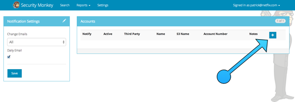
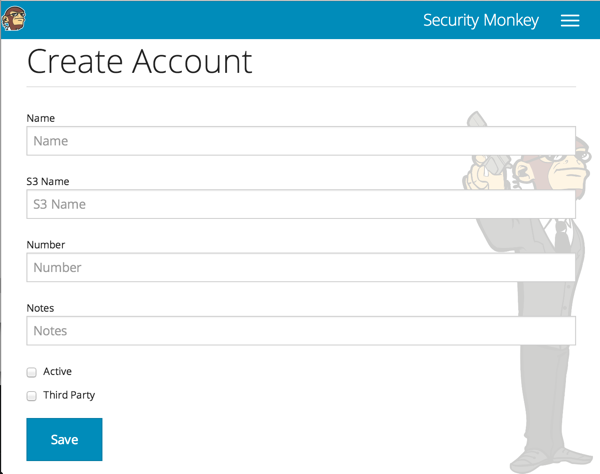
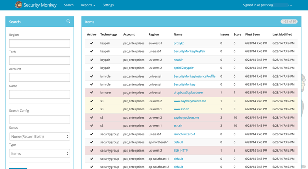

User Guide
==========

Logging into the UI
===================

You should now be able to reach your server

After you have registered a new account and logged in, you need to add an account for Security Monkey to monitor. Click on "Settings" in the very top menu bar.

Adding an Account in the Web UI
-------------------------------

Here you will see a list of the accounts Security Monkey is monitoring.

Click on the plus sign to create a new account:

Now we will provide Security Monkey with information about the account you would like to monitor.

When creating a new account in Security Monkey, you may use any "Name" that you would like. Example names are 'prod', 'test', 'dev', or 'it'. Names should be unique.

The **S3 Name** has special meaning. This is the name used on S3 ACL policies. If you are unsure, it is probably the beginning of the email address that was used to create the AWS account. (If you signed up as <super_geek@example.com>, your s3 name is probably super\_geek.) You can edit this value at any time.

The **Number** is the AWS account number. This must be provided.

**Notes** is an optional field.

**Active** specifies whether Security Monkey should track policies and changes in this account. There are cases where you want Security Monkey to know about a friendly account, but don't want Security Monkey to track it's changes.

**Third Party** This is a way to tell security monkey that the account is friendly and not owned by you.

**Note: You will need to restart the scheduler whenever you add a new account or disable an existing account.** We plan to remove this requirement in the future.:

    $ sudo supervisorctl
    securitymonkey                   RUNNING    pid 11401, uptime 0:05:56
    securitymonkeyscheduler          FATAL      Exited too quickly (process log may have details)
    supervisor> start securitymonkeyscheduler
    securitymonkeyscheduler: started
    supervisor> status
    securitymonkey                   RUNNING    pid 11401, uptime 0:06:49
    securitymonkeyscheduler          RUNNING    pid 11519, uptime 0:00:42
    supervisor>

The first run will occur in 15 minutes. You can monitor all the log files in /var/log/security\_monkey/. In the browser, you can hit the `` `AutoRefresh ``\` button so the browser will attempt to load results every 30 seconds.

**Note: You can also add accounts via the command line with manage.py**:

    $ monkey add_account_aws --number 12345678910 --name account_foo
    Successfully added account account_foo

If an account with the same number already exists, this will do nothing, unless you pass `--force`, in which case, it will override the existing account:

    $ monkey add_account_aws --number 12345678910 --name account_foo
    An account with id 12345678910 already exists
    $ monkey add_account_aws --number 12345678910 --name account_foo --active false --force
    Successfully added account account_foo

Now What?
=========

Wow. We have accomplished a lot. Now we can use the Web UI to review our security posture.

Searching in the Web UI
-----------------------

On the Web UI, click the Search button at the top left. If the scheduler is setup correctly, we should now see items filling the table. These items are colored if they have issues. Yellow is for minor issues like friendly cross account access while red indicates more important security issues, like an S3 bucket granting access to "AllUsers" or a security group allowing 0.0.0.0/0. The newest results are always at the top.

We can filter these results using the searchbox on the left. The Region, Tech, Account, and Name fields use auto-complete to help you find what you need.

Security Monkey also provides you the ability to search only for issues:

Viewing an Item in the Web UI
-----------------------------

Clicking on an item in the web UI brings up the view-item page.

This item has an attached issue. Someone has left SSH open to the Internet! Security Monkey helps you find these types of insecure configurations and correct them.

If Security Monkey finds an issue that you aren't worried about, you should justify the issue and leave a message explaining to others why the configuration is okay.

Security Monkey looks for changes in configurations. When there is a change, it uses colors to show you the part of the configuration that was affected. Green tells you that a section was added while red says something has been removed.

Each revision to an item can have comments attached. These can explain why a change was made.

